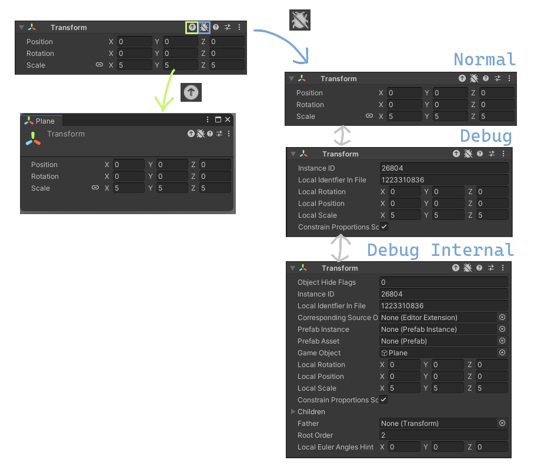


# EditorHeaderButtons

---

コンポーネントのインスペクタのヘッダーに便利機能を追加
1. **プロパティ表示ボタン** 該当コンポーネントのエディターを別ウィンドウで表示する（メニューにある「Property...」と同じ）
2. **デバッグ表示切り替えボタン** インスペクタモードを**Normal**、**Debug**、**Debug Internal** の間で切り替える

※ このスクリプトを asmdef "Assembly-CSharp-Editor-testable" 下に格納してください。

---

Add two buttons to the Header of the Component Inspector
1. **Show Properties Button** Shows a popup editor of the component (shortcut of "Properties..." in the menu)
2. **Switch Debug Mode Button** Switches inspector mode between **Normal**, **Debug**, and **Debug Internal**.

※ Please put this script under asmdef "Assembly-CSharp-Editor-testable".